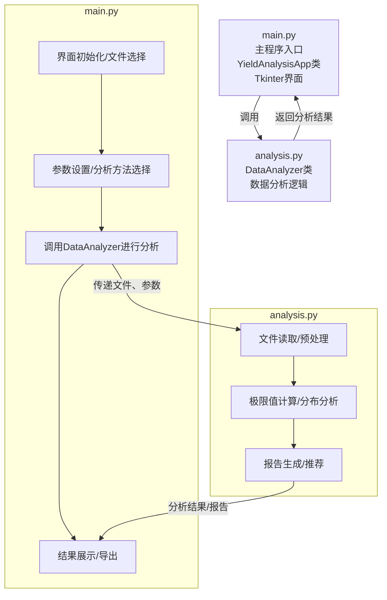
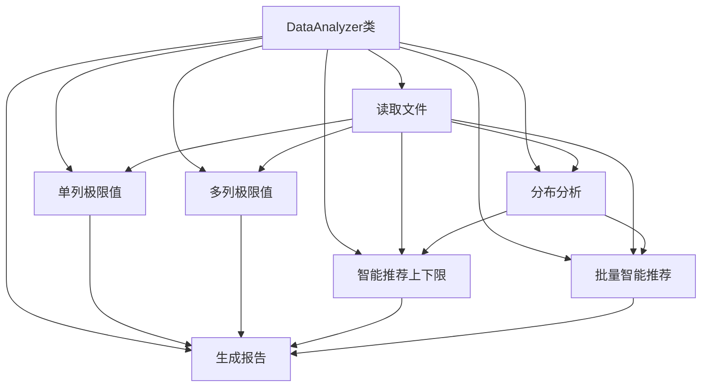

# SmartYieldTool
# 项目架构图

## 整体架构

## 数据分析详细架构

> 说明：  
> - 读取文件：_read_file  
> - 单列极限值：calculate_limits  
> - 多列极限值：calculate_limits_for_columns  
> - 分布分析：analyze_distribution  
> - 智能推荐上下限：smart_recommend_limits  
> - 批量智能推荐：smart_recommend_limits_for_columns  
> - 生成报告：generate_report  
